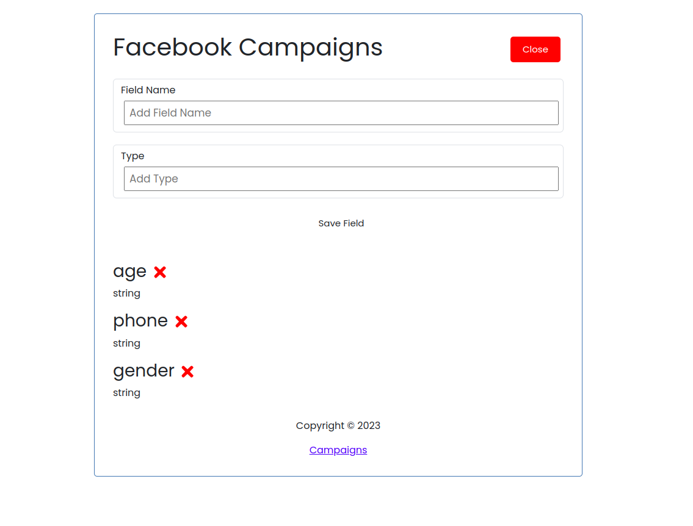
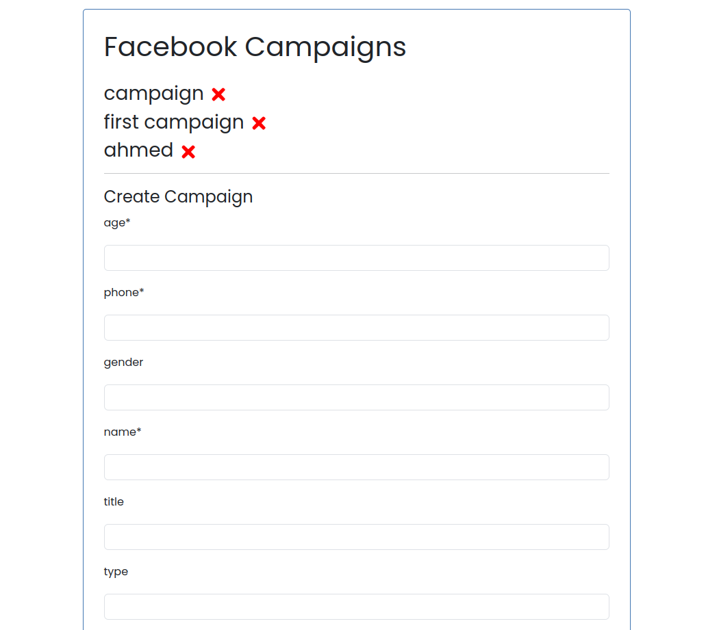
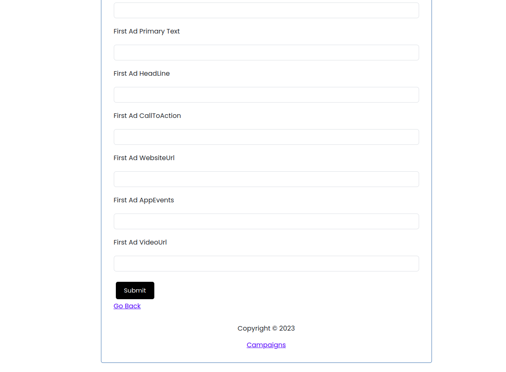
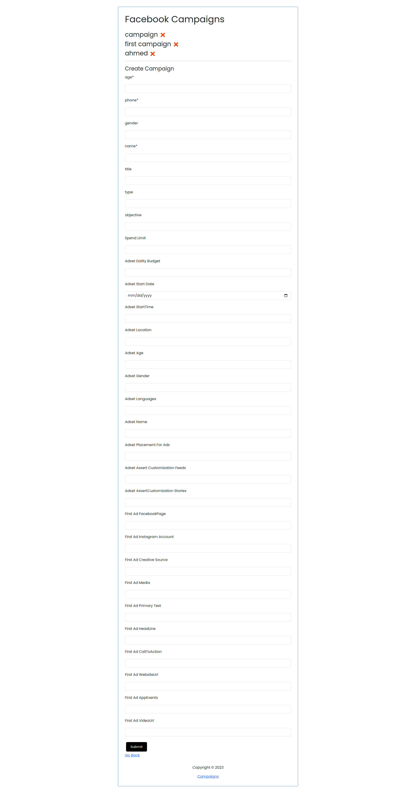

Included Front end part created with react frameowork and backend part created with nodejs and mongoDB.


List of features!

1. User can create custumizaed fields to be rendered in campaigns form using dyanmic form react package https://react-jsonschema-form.readthedocs.io/en/latest/
2. User can create their own Campaigns to facebook APIs using facebook SDK https://www.npmjs.com/package/facebook-nodejs-business-sdk
3. User can delete realted fields and campaigns created








Everything is created dynamically either in code or by user and it's clear and easy to maintain and edits.

<h1>To run back end</h1>

> make sure you add database url in db.config file
> make sure you add facebook user token and account token in app.config
```
npm install
```

### Run
```
node server.js
```

<h1>To run front end</h1>
## Usage

### Install dependencies

```
npm install
```

### Run React dev server (http://localhost:3000)

```
npm start
```

### To build for production

```
npm run build
```

